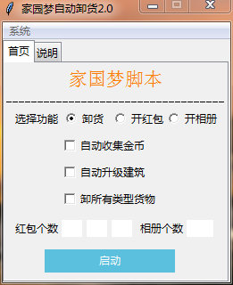

## 家国梦自动卸货脚本注意事项
#### 程序界面

#### 使用说明
 * 下载后直接解压即可使用，无需安装，需要把配置文件config.ini放在C盘根目录下，启动前请先启动模拟器跟游戏！！！
 * 如果需要等火车的时候也可以收集金币请勾选自动收集金币
 * 如果是模拟器微信需要离线，请到配置文件修改is_reboot，这样就不会重启，这时候选择卸所有货物效率会高一些
 * （慎用，目前有bug，如不小心点击了，请按Ctrl+Alt+Delete调出管理器，中断程序）开红包，选择红包模式，输入红包个数，依次福气红包，多福红包，满福红包

***
目前小程序还有一些小问题尚未解决，比如鼠标定位可能不准，停在登录界面等等问题...只能留待日后解决
(可以在贴吧私信反馈我或者扫下面的二维码进群，我看到了会帮你解决，贴吧id：往事吥堪回首u)
***
#### 注意事项：
 * 务必将配置文件放在C盘根目录
 * 修改配置文件请重新启动本程序
 * 如果遇到程序闪退情况，请把配置文件另存为，保存编码选择ANSI；
 * 如果遇到程序一直没有停在那里等待火车，或者报错image index out of range之类的，请修改配置文件small_simulator，小屏用户（分辨率最大1368x768），请将small_simulator
改为yes，并用鼠标拖拽将模拟器高度设置为700，宽度自适应；大屏用户请将small_simulator改为no，雷电模拟器需设置，  设置 -> 性能设置 -> 手机版 -> 560x960(dpi240) ->保存重启
 * 开红包，相册功能目前发现停不下来的BUG，请慎用！！
 * 请尽可能使用雷电模拟器，下载地址https://www.ldmnq.com/ （如果不是雷电模拟器，需要在配置文件中修改window_name）
 * 如果报错：无法定位程序输入点ucrtbase.terminate于动态链接库api-ms-win-crt-runtime-l1-1-0.dll，请参考：https://blog.csdn.net/wsasy12345/article/details/82746861
 * 如果报错：此文件版本与WINDOWS运行版本不兼容，请检查计算机的系统信息以了解需要X86（32位）还是x64（64位）版本的程序，请联系开发者，说明电脑操作系统不是32位的，目前无法解决

嗯，就先写到这里吧，还有的问题等我想起来在说吧
***
#### 软件BUG反馈：

***
创作不易，如有bug，敬请理解...

                                                --by doever 2019/10/09